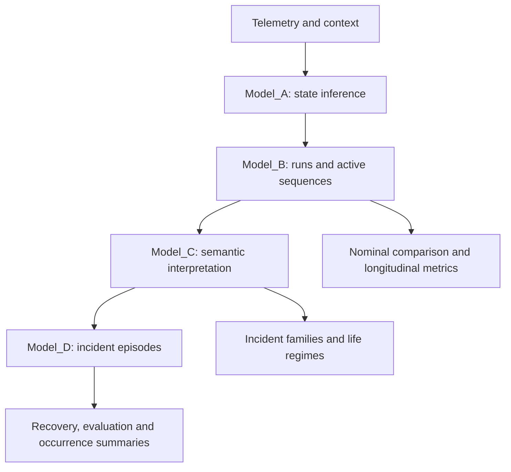

# Industrial Asset Behavioral Monitoring

Implementation, datasets, semantic artifacts, and documentation for a data-driven framework for **longitudinal behavioral monitoring of industrial assets**. The repository now emphasizes **incident families**, **episode-oriented analysis**, and **reliability-informed interpretation** built on top of operational-state inference and hierarchical sequence modeling.

This repository accompanies a research workflow on **behavioral proxies of asset-life evolution in IIoT-enabled industrial environments**. It is intended both as a **reproducibility resource** and as a **reusable software scaffold** for weakly instrumented industrial assets where direct reliability labels are scarce or incomplete.

---

## Overview

The repository is organized around four progressive modeling layers that mirror the updated analytical workflow:

- **Model_A** (`iabm`)
  Supervised identification of elementary operational states from synchronized analog and digital industrial signals.

- **Model_B** (`iabm_behavior`)
  Extraction of contiguous state runs, active behavioral sequences, nominal references, and longitudinal divergence and recovery metrics.

- **Model_C** (`iabm_semantics`)
  Reliability-informed semantic interpretation of behavioral sequences into operating modes, working modes, incident families, life regimes, and recovery regimes.

- **Model_D** (`iabm_incidents`)
  Explicit longitudinal processing of scored windows into detected episodes, family assignments, recovery assessments, registry-aligned evaluations, and occurrence summaries.

Together, these packages implement a coherent hierarchical workflow:

1. **Telemetry and contextual signals** are synchronized and transformed into elementary state predictions.
2. **State trajectories** are aggregated into runs and behavioral sequences.
3. **Behavioral words and nominal baselines** are compared to estimate divergence, recurrence, persistence, and recovery.
4. **Semantic and reliability-informed layers** interpret sequence patterns as incident families and asset-life proxies.
5. **Longitudinal incident processing** turns window-level deviations into episodes, recovery views, evaluation reports, and occurrence-oriented summaries.

---

## Updated analytical orientation

The repository is no longer centered only on operating-mode identification or anomaly detection. Its current methodological emphasis is:

- **longitudinal behavioral monitoring**
- **incident-family discovery and assignment**
- **episode construction with pre-event and recovery windows**
- **reliability-informed interpretation of asset-life evolution**
- **family-specific occurrence modelling scaffolding**

This makes the codebase suitable not only for state recognition, but also for interpreting how repeated behaviors can act as weak proxies for degradation, disturbance recurrence, intervention effects, and stabilization regimes.

## Hierarchical pipeline



```text
telemetry + context
        |
        v
Model_A: operational-state inference
        |
        v
Model_B: runs -> active sequences -> nominal comparison
        |                 |
        |                 +--> longitudinal metrics
        |                      recurrence, persistence,
        |                      duration drift, recovery
        v
Model_C: semantic and reliability-informed interpretation
        |
        +--> operating / working modes
        +--> incident families
        +--> life regimes
        +--> recovery regimes
        v
Model_D: longitudinal incident processing
        |
        +--> window scores
        +--> detected episodes
        +--> recovery assessment
        +--> registry-based evaluation
        +--> occurrence summaries
```

## Relation to the paper

The repository mirrors the main methodological stages of the updated paper:

- **Operational-state inference** -> `Model_A`
- **Behavioral sequence construction and longitudinal divergence metrics** -> `Model_B`
- **Reliability-informed semantic interpretation** -> `Model_C`
- **Episode detection, evaluation, and family-oriented occurrence summaries** -> `Model_D`
- **Ontology-aligned contextualization and weak labels** -> `ontology/`
- **User and developer documentation** -> `docs/`

In this sense, the repository is not only a software release, but also a reproducibility resource for the empirical workflow described in the manuscript.

## Repository structure

```text
industrial-asset-behavioral-monitoring/
├── CHANGELOG.md
├── LICENSE
├── README.md
├── data/
├── docs/
├── ontology/
└── src/
    ├── Model_A/
    ├── Model_B/
    ├── Model_C/
    └── Model_D/
```

## Data

The repository includes industrial datasets used to support the layered monitoring workflow:

- `data/analogicas_nonans.parquet`
  Preprocessed analog industrial monitoring signals.

- `data/digitales.parquet`
  Synchronized digital and control-layer signals.

These datasets provide the basis for state inference, behavioral sequence extraction, semantic interpretation, and longitudinal incident analysis.

## Semantic schema

The repository includes a lightweight ontology-aligned contextualization schema under `ontology/`.

### Contents

- `ontology/iabm.ttl`
  Core schema defining observations, operational states, behavioral sequences, operating and working modes, incident episodes, incident families, recovery regimes, life regimes, and weak labels.

- `ontology/examples/wheel_washer.ttl`
  Minimal instance-level example derived from the wheel-washing use case.

- `ontology/examples/wheel_washer_incidents.ttl`
  Extended example showing incident-family, recurrence, and recovery-oriented entities.

- `ontology/queries/example_queries.rq`
  Illustrative SPARQL queries showing how semantic entities can be explored and retrieved.

## Installation

Each modeling layer is maintained as its own Poetry package. Install the package that matches the layer you want to run.

```bash
git clone https://github.com/Ind50-UPM/industrial-asset-behavioral-monitoring.git
cd industrial-asset-behavioral-monitoring
```

### Model_A

```bash
cd src/Model_A
poetry install
poetry run industrial-id --help
python -m iabm.main --help
```

### Model_B

```bash
cd src/Model_B
poetry install
poetry run iabm-behavior --help
python -m iabm_behavior.main --help
```

### Model_C

```bash
cd src/Model_C
poetry install
poetry run iabm-semantics --help
python -m iabm_semantics.main --help
```

### Model_D

```bash
cd src/Model_D
poetry install
poetry run industrial-incidents --help
python -m iabm_incidents.main --help
```

## Minimal workflow

A minimal end-to-end workflow is:

1. Run `Model_A` to train or load the state-identification model and generate state predictions.
2. Run `Model_B` on the resulting state timeline to obtain runs, active sequences, nominal comparisons, and longitudinal metrics.
3. Run `Model_C` on the sequence outputs to generate incident-family assignments and reliability-informed summaries.
4. Run `Model_D` to convert those outputs into scored windows, detected episodes, recovery assessments, and occurrence summaries.

This layered structure allows the repository to be used incrementally, depending on whether the user is interested in state inference only, behavioral monitoring, semantic interpretation, or episode-oriented longitudinal analysis.

## Full-Horizon Model_D Results

The repository includes a consolidated **full-horizon reassessment** for
`Model_D` covering the requested period from **January 2022** to **June 2026**.
The generated executive artifacts are stored under
`src/predictions/Model_D/final_reassessment/`.

Key deliverables include:

- `model_d_final_report.html`: executive HTML report with charts and caveats
- `model_d_final_mode_summary.csv`: mode-level aggregated performance table
- `model_d_final_month_summary.csv`: month-level summary including horizon status
- `model_d_reassessment_metadata.json`: processed-horizon metadata
- `model_d_reassessment_salvedades.json`: explicit caveats and interpretation notes

The current full-horizon run processed **50 available months** within the
requested horizon. The following months are absent from the underlying data and
are therefore marked as missing in the report:
`202211`, `202212`, `202408`, and `202506`.

A small number of months must be interpreted with additional caution. In the
latest run, `202505` was classified as a **low-data month** because it only
contained minimal activity, which can suppress episode generation without
implying nominal behavior.

For comparative interpretation, the most useful metrics are currently
`episode_recall`, `family_recall`, and temporal overlap indicators such as
`mean_temporal_iou`. The precision-like fields in the current evaluator remain
useful for internal debugging, but they should not be treated as final scientific
precision estimates because repeated registry alignments can inflate them.

## Documentation

Project documentation is available in the `docs/` folder and can also be published as a Sphinx site.

The documentation includes:

A concise guide to the generated prediction artifacts is also available at `src/predictions/README.md`.

- repository overview,
- reproducibility guidance,
- semantic schema description,
- package-oriented pages for `Model_A`, `Model_B`, `Model_C`, and `Model_D`,
- incident taxonomy,
- longitudinal validation guidance,
- reliability-informed interpretation notes.

If Sphinx is installed, documentation can be built locally from `docs/` with:

```bash
make html
```

The documentation for this development is publicly available at https://ind50-upm.github.io/industrial-asset-behavioral-monitoring/

## Reproducibility

The repository is intended to support reproducibility of the updated analytical workflow reported in the paper.

In particular, it provides:

- industrial datasets,
- refactored software layers used in the study,
- semantic artifacts for contextual and longitudinal interpretation,
- tests for state, sequence, semantic, and episode layers,
- technical documentation describing the relation between code, data, and analytical stages.

## Citation

Citation details will be added once a stable public reference is available. For the time being, the repository should be cited as the software and data companion to the corresponding research work on industrial asset longitudinal behavioral monitoring and incident-family interpretation.

## License

This repository is distributed under the terms of the AGPL-3.0 license. See [LICENSE](LICENSE) for details.

## Contact

For scientific or technical questions related to the repository, please use the GitHub issue tracker or contact the corresponding author through the institutional details provided in the associated manuscript.
