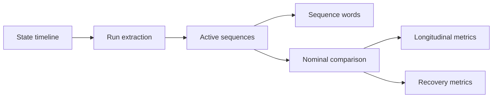

# Model_B: Behavioral Sequence Analysis

`Model_B` is the second modelling layer in the Industrial Asset Behavioral
Monitoring framework. It transforms state timelines into contiguous state runs,
active behavioral sequences, sequence-word summaries, and anomaly-oriented
comparisons against nominal references.

## Responsibilities

- load state timelines from Excel, CSV, or Parquet
- smooth short transients before run extraction
- derive contiguous state runs
- group non-zero runs into active sequences
- summarize repeated sequence words
- compare observed sequences against nominal references
- compute longitudinal metrics and recovery-oriented traces

## Runtime role



## Package layout

```text
src/Model_B/
├── iabm_behavior/
│   ├── main.py
│   ├── sequences.py
│   └── utils.py
├── tests/
└── README.md
```

## CLI examples

Analyze a state timeline and export CSV artefacts:

```bash
python -m iabm_behavior.main   --input ../../data/model_b_state_timeline.parquet   --output-dir ../../src/predictions/Model_B   --smooth-short-runs   --output-format csv
```

Compare a month against a nominal reference timeline:

```bash
python -m iabm_behavior.main   --input observed_timeline.parquet   --nominal-input nominal_timeline.parquet   --output-dir ./reports   --anomaly-threshold 1.0   --output-format csv
```

## Outputs

- `state_runs`: contiguous runs of the same state
- `active_sequences`: grouped non-zero sequences with start/end timestamps
- `sequence_words`: repeated sequence patterns and average durations
- `sequence_comparison`: anomaly-oriented comparison against nominal words
- `sequence_longitudinal_metrics`: recurrence, persistence, drift, and divergence
- `recovery_metrics`: anomaly-to-recovery transitions
- `incident_episode_metrics`: family-oriented signature summary

## Batch orchestration

The repository-level utility `src/generate_model_bc_batch.py` uses `Model_B`
month by month to process the real historical campaign while preserving
restartability and manifest traceability.
