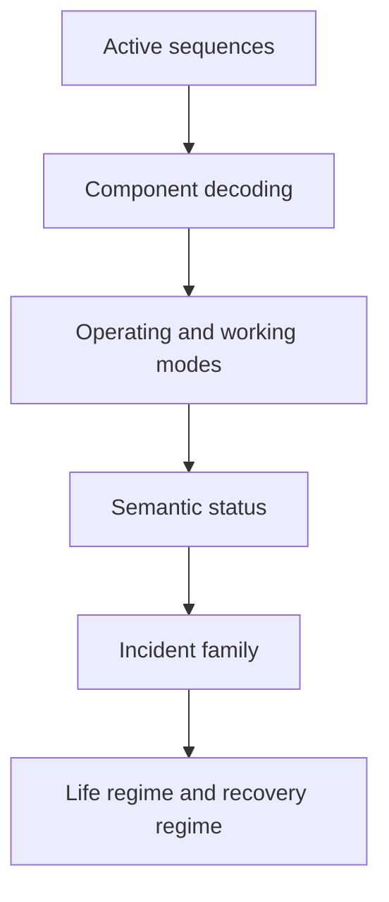

# Model_C: Semantic Mode Interpretation

`Model_C` is the third modelling layer in the Industrial Asset Behavioral
Monitoring framework. It interprets behavioral sequences from `Model_B` as
semantic operating modes, working modes, incident families, life regimes, and
recovery regimes.

## Responsibilities

- load `Model_B` active-sequence reports
- optionally enrich interpretation with anomaly comparison outputs
- decode state words into industrial component sets
- infer operating and working modes
- assign incident-family proxies
- summarize life and recovery regimes for downstream longitudinal analysis

## Interpretation flow



## CLI examples

Interpret a `Model_B` active-sequence report:

```bash
python -m iabm_semantics.main   --input ../Model_B/active_sequences.csv   --output-dir ./reports   --output-format csv
```

Interpret the same report while enriching semantic status with anomaly context:

```bash
python -m iabm_semantics.main   --input ../Model_B/active_sequences.csv   --comparison-input ../Model_B/sequence_comparison.csv   --output-dir ./reports   --output-format csv
```

## Outputs

- `semantic_assignments`: per-sequence semantic interpretation
- `incident_family_assignments`: alias export with the same row-level semantic payload
- `semantic_mode_summary`: aggregated counts by mode, semantic status, family, and life regime
- `asset_life_regime_summary`: life and recovery regime consolidation

## Batch orchestration

The repository-level utility `src/generate_model_bc_batch.py` now couples
`Model_B` and `Model_C` month by month so semantic interpretation can scale to
large historical telemetry archives without losing manifest traceability.
