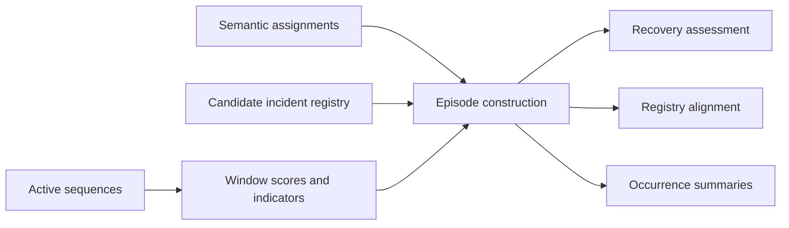

# Model_D

`Model_D` introduces the longitudinal incident layer on top of sequence and
semantic outputs. It combines explicit scoring, segmentation, family
assignment, recovery assessment, registry evaluation, and occurrence-oriented
summaries.

## Architectural view



## Main responsibilities

- `detection.py`: window-level deviation scoring with typed weighting
- `segmentation.py`: sustained onset detection and temporal gap handling
- `classification.py`: explainable rule-based family assignment
- `recovery.py`: hysteresis-inspired recovery confirmation
- `evaluation.py`: temporal validation against a canonical incident registry
- `episodes.py`: orchestration layer that materializes detected episodes
- `occurrence.py`: family-level recurrence summaries
- `registry_builder.py`: weakly labelled candidate-registry generation

## Inputs

The current baseline is compatible with:

- sequence tables with `start_time` and `end_time`
- semantic assignments with at least `semantic_status` and `incident_family`
- candidate or canonical registries with documented incident intervals

When advanced deviation indicators are available, `Model_D` also consumes
window-level metrics such as `sequence_divergence`, `duration_drift`,
`recurrence_excess`, `persistence_excess`, `consumption_deviation`,
`state_error_rate`, and `mode_divergence`.

## CLI examples

Default execution:

```bash
python -m iabm_incidents.main   --sequences path/to/active_sequences.csv   --assignments path/to/semantic_assignments.csv   --output-dir outputs/model_d   --output-format csv
```

Execution with explicit configuration and registry alignment:

```bash
python -m iabm_incidents.main   --config configs/model_d.example.json   --sequences path/to/active_sequences.csv   --assignments path/to/semantic_assignments.csv   --registry path/to/candidate_incident_registry_refined.csv   --output-dir outputs/model_d   --output-format csv
```

## Batch support

The repository-level utility `src/generate_candidate_incident_registry_batch.py`
creates month-wise weakly labelled registries that complement the semantic
outputs produced upstream by `generate_model_bc_batch.py`.

## Full-Horizon Reassessment

The repository now includes a consolidated `Model_D` reassessment across the
full requested horizon from **2022-01** through **2026-06**. The resulting
artifacts are written to:

- `src/predictions/Model_D/final_reassessment/model_d_final_report.html`
- `src/predictions/Model_D/final_reassessment/model_d_final_mode_summary.csv`
- `src/predictions/Model_D/final_reassessment/model_d_final_month_summary.csv`
- `src/predictions/Model_D/final_reassessment/model_d_reassessment_metadata.json`
- `src/predictions/Model_D/final_reassessment/model_d_reassessment_salvedades.json`

### Current interpretation baseline

- The latest full-horizon run processed `50` available months.
- Missing months inside the requested horizon are explicitly tracked as
  `202211`, `202212`, `202408`, and `202506`.
- `202505` is currently flagged as a low-data month and should not be read as a
  strong nominality signal.
- Across the latest consolidated run, the semantic route remained the most
  efficient and informative baseline, while the indicator route remained useful
  as a complementary confirmation path.

### Executive reading guidance

When interpreting the final report, prioritize:

- `episode_recall`
- `family_recall`
- `mean_temporal_iou`
- runtime and month coverage

Treat `episode_precision` and `family_precision` as provisional engineering
metrics until the registry-matching evaluator is tightened to avoid repeated
alignment inflation.

## Outputs

- `window_scores`
- `detected_episodes`
- `family_assignments`
- `recovery_assessment`
- `evaluation_summary`
- `occurrence_summary`
- `incident_registry_matches` and `registry_evaluation_summary` when a registry is provided
- `model_d_run_metadata.json`
