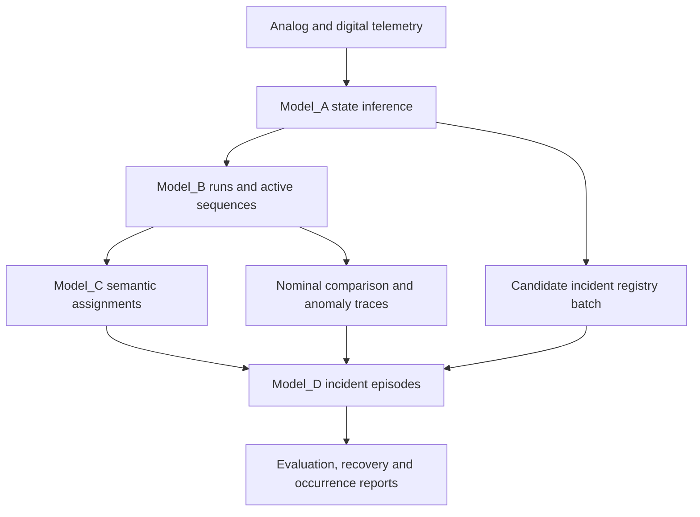

# Source Packages

This directory contains the implementation packages, batch orchestration tools,
and generated artefacts used across the repository.

## Repository layout

- `Model_A/`: elementary operating-state identification, published locally as `iabm`
- `Model_B/`: behavioral sequence extraction, nominal comparison, and longitudinal metrics
- `Model_C/`: semantic, family-oriented, and reliability-informed interpretation
- `Model_D/`: candidate registries, longitudinal episode construction, and occurrence summaries
- `predictions/`: validation reports, monthly batch outputs, and consolidated exports
- `concat_monthly_csv_to_parquet.py`: CSV-to-Parquet consolidation helper
- `generate_model_bc_batch.py`: month-wise `Model_B -> Model_C` orchestration
- `generate_candidate_incident_registry_batch.py`: month-wise candidate incident registry generation

## End-to-end flow



## Batch utilities

The repository now includes explicit batch runners so long industrial campaigns
can be processed month by month instead of relying on fragile monolithic runs.

### `generate_model_bc_batch.py`

Builds monthly `Model_B` and `Model_C` artefacts from `data/estados_nonans.parquet`.

```bash
python src/generate_model_bc_batch.py --output-dir src/predictions
```

### `generate_candidate_incident_registry_batch.py`

Builds monthly weakly labelled candidate registries from the real Model_D inputs.

```bash
python src/generate_candidate_incident_registry_batch.py --output-dir src/predictions/Model_D
```

## Operational notes

- Monthly manifests record processed, reused, empty, and failed months.
- Consolidated CSV outputs are intended to feed downstream validation and final Model_D runs.
- The Sphinx site in `docs/` provides deeper API reference and architecture diagrams.
